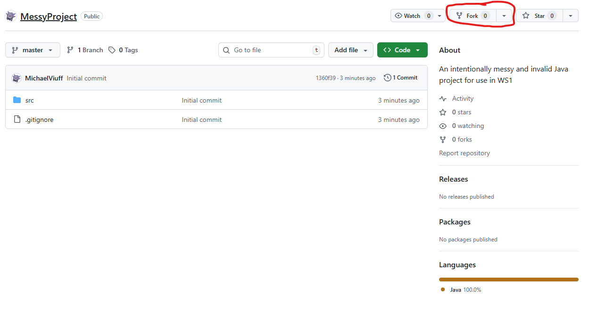
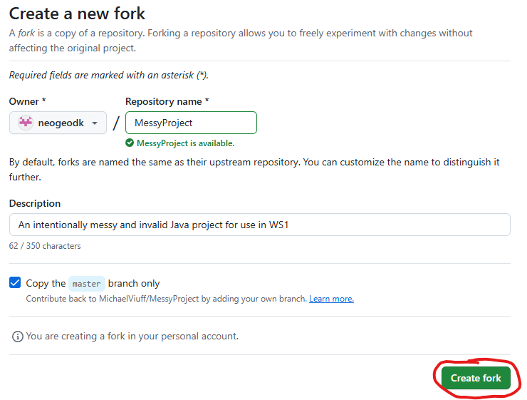
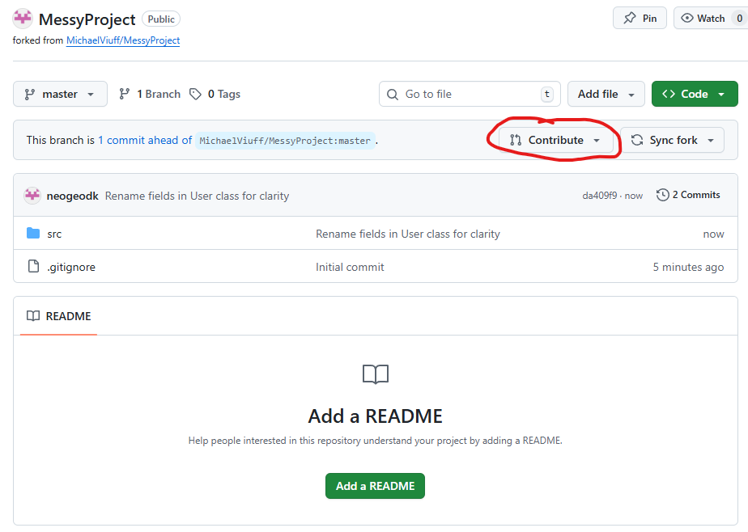
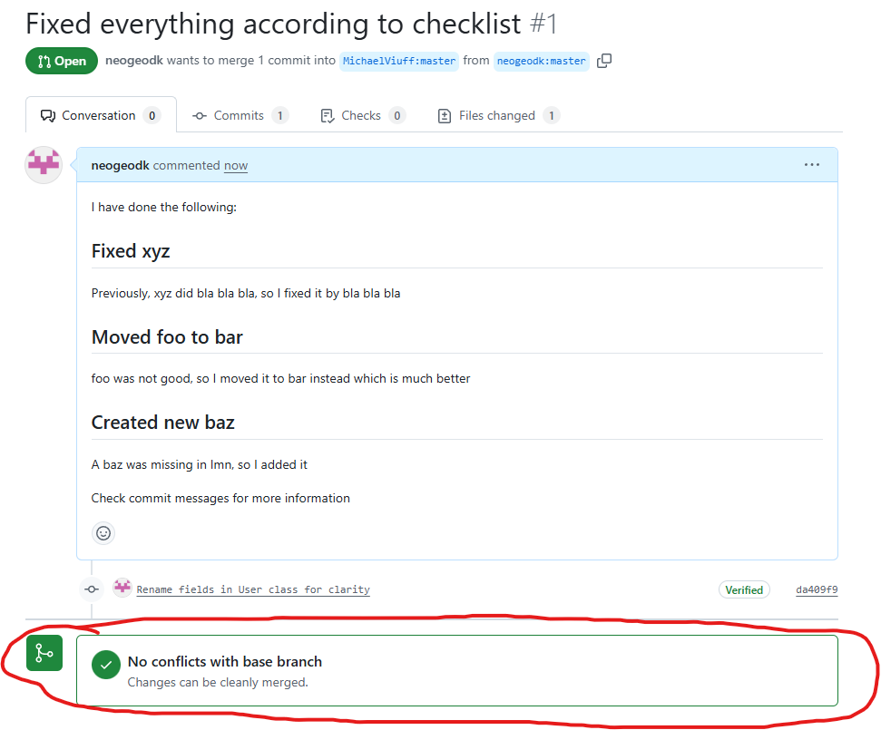

# Code Review
I dette modul vil du lære at gennemgå kode, med henblik på at finde fejl og komme med forslag til forbedringer.

Modulet tager udgangspunkt i GitHub og GitHub pull-requests.

## Læringsmål
Efter at have gennemført dette modul har du opnået følgende færdigheder:

 - Du kan gennemse andres kode.
 - Du kan give konstruktiv feedback baseret på en tjekliste.
 - Du kan gennemføre et code-review via GitHub pull requests.

## Forberedelse

Se denne video for en kort gennemgang af hvad GitHub Pull Request er:  
(**OBS**: Opgaverne benytter et andet flow, så lad være med at følge videoen step-by-step)

[How to create a pull request in 4 min | GitHub for Beginners](https://www.youtube.com/watch?v=nCKdihvneS0)

Kort gennemgang af begrebet fork:  
[Why do we Fork on GitHub?](https://www.youtube.com/watch?v=VbfvQzCoiQc)

## Opgaver
Da du ikke er collaborator på det project du laver ændringer i skal du lave en fork af projektet først.  

Så flowet kommer til at se således ud:

Fork  →  Clone  →   Lav ændringer  →  Commit  →  Push  →  Pull Request  
&nbsp;&nbsp;&nbsp;&nbsp;&nbsp;&nbsp;&nbsp;&nbsp;&nbsp;&nbsp;&nbsp;&nbsp;&nbsp;&nbsp;&nbsp;&nbsp;&nbsp;&nbsp;&nbsp;&nbsp;&nbsp;&nbsp;&nbsp;&nbsp;&nbsp;&nbsp;&nbsp;&nbsp;&nbsp;&nbsp;&nbsp;&nbsp;&nbsp;&nbsp;&nbsp;&nbsp;&nbsp;&nbsp;&nbsp;&nbsp;↑───────┘  

### Fork
Start med at lave en fork af [dette projekt](https://github.com/MichaelViuff/MessyProject.git).

### Clone
Nu har du en fork af repositoriet på din egen GitHub.  

Lav en clone af dette repository til din egen maskine som du plejer.

### Lav ændringer
Brug [denne checkliste](CHECKLIST.md) til at gennemgå koden.

Når du finder og retter en fejl, så sørg for at commit dine ændringer løbende, i stedet for at ende med eet gigantisk commit til sidst.  
På den måde kan du lave gode, konkrette commit messages til hvert commit.

### Commit
Hver gang du laver ændringer i koden, så lav et commit, hvor du i commit message beskriver hvilket punkt på listen du har identificeret, og hvad du har gjort for at rette op på det.

### Push
Når du er færdig med alle dine ændringer pusher du dine commits til dit GitHub repository (din fork)

### Pull Request
Det sidste step, Pull Request, kan laves via web-interfacet på GitHub, eller via CLI.  
Jeg viser her hvordan du kan gøre via web-interfacet:

Start med at finde Contribute-knappen (i dit eget repository på GitHub):

Når den folder ud vælger du bare "Open pull request":

I det vindue der nu vises, sørger du for at få skrevet følgende ind:

#### Titel
SKRIV DIT NAVN + STUDIENUMMER HER SÅ JEG KAN IDENTIFICERE DIG

#### Description
For at gøre det overskueligt at forstå dine ændringer, skal du for hver ændring skrive en kort overskrift over hvad det er du har ændret, og en meget kort beskrivelse af hvad du gjorde (se billedet nedenunder for et eksempel).

Når du er færdig trykker du på "Create pull request" knappen.

Hvis alt er gået som det skal, burde du få vist "No conflicts with base branch" som vist på dette billede:

## Aflevering
Din Pull Request er din aflevering, men for at kunne modtage feedback på Itslearning er der stadig en assignment.  
Her skal du markere når du er færdig (du skal ikke vedhæfte noget, men bare skrive i tekst-feltet at du har gennemført opgaven).

Deadline og formalia kan ses på Itslearning.